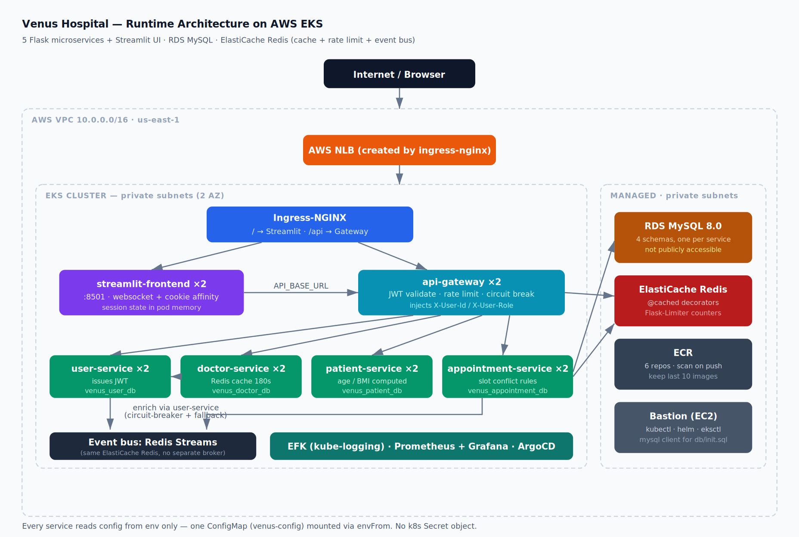
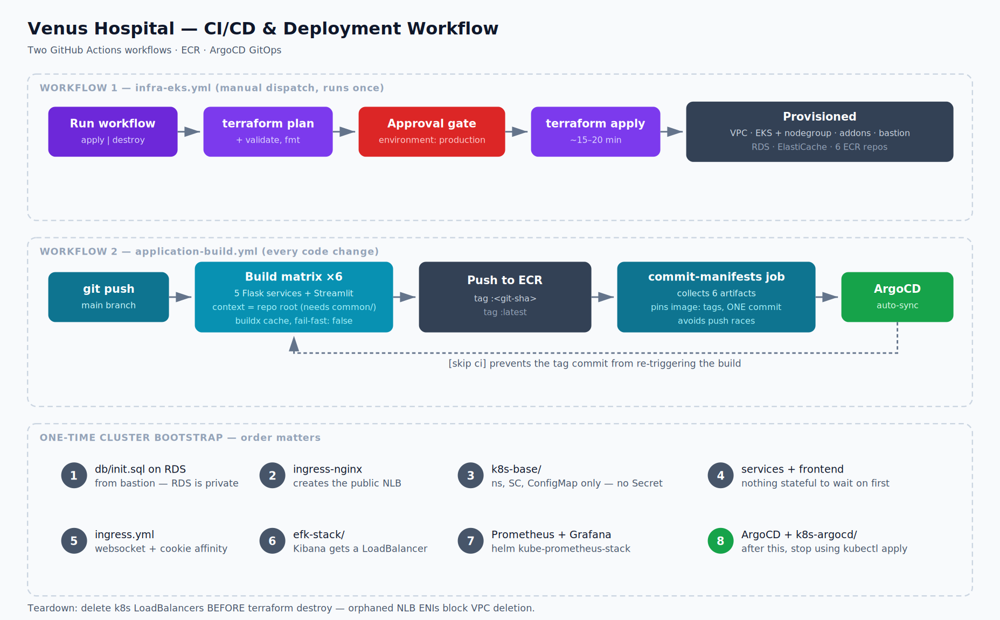

# Venus Multispecialty Hospital — Microservices on AWS EKS

Python/Flask microservices + Streamlit UI, deployed to Amazon EKS with
Terraform, Docker, ECR, ArgoCD, EFK and Prometheus/Grafana.

> Application internals (code layout, the Java→Python mapping, how each
> service works) live in [APPLICATION.md](APPLICATION.md). This file is
> the deployment guide.

---

## Architecture & workflow diagrams

### Runtime architecture



### CI/CD and deployment workflow



---

## Architecture (text)

```
                          Internet
                             │
                  ┌──────────▼───────────┐
                  │  AWS NLB (created by  │
                  │  ingress-nginx)       │
                  └──────────┬───────────┘
                             │
                  ┌──────────▼───────────┐
                  │  Ingress-NGINX        │
                  │  /     → Streamlit    │
                  │  /api  → API Gateway  │
                  └─────┬──────────┬──────┘
                        │          │
        ┌───────────────▼──┐   ┌───▼──────────────────────┐
        │ streamlit-front   │   │ api-gateway (Flask)      │
        │ :8501  (2 pods)   │   │ • JWT validation         │
        └───────────────────┘   │ • Flask-Limiter (Redis)  │
                                │ • pybreaker per route    │
                                └──┬───┬────┬────┬─────────┘
                                   │   │    │    │
        ┌──────────────────────────┘   │    │    └───────────────┐
        │              ┌───────────────┘    └──────┐             │
   ┌────▼─────┐   ┌────▼──────┐   ┌────────────▼─┐  ┌─────▼───────────┐
   │  user-   │   │  doctor-  │   │   patient-   │  │  appointment-   │
   │ service  │   │  service  │   │   service    │  │    service      │
   └────┬─────┘   └────┬──────┘   └──────┬───────┘  └────────┬────────┘
        │              │                 │                   │
        └──────────────┴────────┬────────┴───────────────────┘
                                │
                  ┌─────────────┴──────────────┐
                  │                            │
        ┌─────────▼─────┐          ┌───────────▼───────────┐
        │ RDS MySQL      │          │ ElastiCache Redis      │
        │ 4 schemas      │          │ cache + rate limits    │
        │ (private)      │          │ + event bus (Streams)  │
        └────────────────┘          └────────────────────────┘

Cross-cutting: EFK (kube-logging) · Prometheus+Grafana (prometheus) · ArgoCD (argocd)
```

### Component map

| Component | Type | Port | ECR repo | Owns |
|---|---|---|---|---|
| `api-gateway` | Deployment ×2 | 8080 | `venus-api-gateway` | no DB |
| `user-service` | Deployment ×2 | 8080 | `venus-user-service` | `venus_user_db` |
| `doctor-service` | Deployment ×2 | 8080 | `venus-doctor-service` | `venus_doctor_db` |
| `patient-service` | Deployment ×2 | 8080 | `venus-patient-service` | `venus_patient_db` |
| `appointment-service` | Deployment ×2 | 8080 | `venus-appointment-service` | `venus_appointment_db` |
| `streamlit-frontend` | Deployment ×2 | 8501 | `venus-streamlit-frontend` | session state |

---

## Repository layout

```
venus-hospital-python/
├── .github/workflows/
│   ├── infra-eks.yml            # Terraform plan + gated apply
│   └── application-build.yml    # build 6 images → ECR → pin tags in manifests
├── EKS-Terraform/
│   ├── backend.tf               # S3 remote state
│   ├── variables.tf
│   ├── main.tf                  # VPC, subnets, NAT, IAM, EKS, nodegroup, addons, bastion
│   ├── rds.tf                   # MySQL — credentials hardcoded, see note above
│   ├── elasticache.tf           # Redis
│   ├── ecr.tf                   # 6 repos + lifecycle policies
│   └── outputs.tf
├── k8s-base/
│   ├── 00-namespace.yml
│   ├── 01-app-config.yml        # ConfigMap: DB creds, JWT secret, service URLs, Redis
│   ├── 04-storageclass.yml      # ebs-storage (Elasticsearch needs it)
│   └── 05-mysql-incluster.yml   # OPTIONAL — in-cluster MySQL instead of RDS
├── docs/
│   ├── architecture.png/.svg    # runtime architecture diagram
│   └── workflow.png/.svg        # CI/CD + bootstrap order diagram
├── common/                      # shared lib baked into every service image
├── services/<svc>/
│   ├── Dockerfile
│   ├── deployment.yml           # Deployment + ClusterIP Service
│   └── *.py, requirements.txt
├── streamlit_app/
│   ├── Dockerfile
│   ├── deployment.yml
│   └── ingress.yml              # the single Ingress for the whole app
├── efk-stack/                   # Elasticsearch, Fluent Bit, Kibana
├── grafana-prometheus/README.md
├── k8s-argocd/                  # ArgoCD Application CRs
└── db/init.sql                  # creates the 4 schemas
```

---

## Prerequisites

- AWS account with admin (or equivalent) IAM permissions
- A GitHub repository holding this code
- Terraform ≥ 1.9, kubectl, Docker (local only — CI builds the images)

---

# Deployment — step by step

## Step 1 — Configure GitHub secrets

Repo → **Settings → Secrets and variables → Actions → New repository secret**.
Exactly the four you used before — nothing database-related:

| Secret | Purpose |
|---|---|
| `AWS_ACCESS_KEY_ID` | Terraform + ECR push |
| `AWS_SECRET_ACCESS_KEY` | " |
| `AWS_ACCOUNT_ID` | builds the ECR registry URL |
| `GIT_PAT` | lets CI commit pinned image tags back to `main` |

> Prefer OIDC over long-lived keys? Both workflow files already carry
> the OIDC alternative commented out right next to the access-key
> lines — uncomment `role-to-assume` + `id-token: write`, comment out
> the two access-key lines, drop the two key secrets, add
> `AWS_OIDC_ROLE_ARN` instead.

Also create the **`production` environment** (Settings → Environments) and
add yourself as a required reviewer — the Terraform apply job gates on it.

## Step 2 — Set your own names before the first run

Two placeholders must be changed:

```bash
# 1. Terraform state bucket (must be globally unique)
#    EKS-Terraform/backend.tf              → bucket = "..."
#    .github/workflows/infra-eks.yml       → BUCKET_NAME: ...

# 2. ArgoCD repo URL
sed -i 's|https://github.com/CHANGE-ME/venus-hospital-python.git|<YOUR_REPO_URL>|g' \
  k8s-argocd/*/*.yaml
```

(No DB password placeholder to set — `rds.tf` already has it.)

## Step 3 — Provision infrastructure

GitHub → **Actions → "Infra — Terraform" → Run workflow → apply**.

Runs plan, waits for your approval, then applies. ~15–20 min (EKS control
plane and RDS dominate). No `TF_VAR_db_password` to export — the
workflow needs nothing beyond the four secrets from Step 1.

Locally instead:

```bash
cd EKS-Terraform
terraform init
terraform plan -out=tfplan
terraform apply tfplan
terraform output
```

Note the outputs — the next steps need them:

```
cluster_name       = venus-hospital
rds_endpoint       = venus-hospital-mysql.xxxx.us-east-1.rds.amazonaws.com
redis_endpoint     = venus-hospital-redis.xxxx.cache.amazonaws.com
bastion_public_ip  = 3.x.x.x
```

## Step 4 — Connect kubectl

```bash
aws eks update-kubeconfig --region us-east-1 --name venus-hospital
kubectl get nodes          # expect 3 Ready nodes
```

RDS and Redis are private, so the database bootstrap runs from the
bastion (`ssh ec2-user@<bastion_public_ip>`) — kubectl, helm, eksctl and
the mysql client are preinstalled there by user_data.

## Step 5 — Create the databases

```bash
# From the BASTION (RDS is not publicly accessible)
git clone <YOUR_REPO_URL> && cd venus-hospital-python
mysql -h <rds_endpoint> -u admin -pCloud123 < db/init.sql
```

Expect `venus_user_db`, `venus_doctor_db`, `venus_patient_db`,
`venus_appointment_db`. Tables are created by each service at startup via
SQLAlchemy — there's no schema DDL here to drift out of sync with the models.

`admin` / `Cloud123` are the credentials hardcoded in `rds.tf` — the same
ones already sitting in `k8s-base/01-app-config.yml`. If you changed the
password in `rds.tf` before applying, use that value here instead.

<details>
<summary><b>Alternative: run MySQL inside the cluster instead of RDS</b></summary>

Same either/or your e-commerce project had. Skips RDS entirely — useful
for a cheap demo or a local kind/minikube run:

```bash
kubectl apply -f k8s-base/05-mysql-incluster.yml
kubectl rollout status statefulset/mysql -n venus --timeout=300s

# point the ConfigMap at the in-cluster service instead of RDS
kubectl patch configmap venus-config -n venus --type merge -p \
  '{"data":{"DB_HOST":"mysql","DB_USER":"root","DB_PASSWORD":"root"}}'

kubectl rollout restart deploy -n venus
```

The four schemas are created automatically by the `mysql-init-script`
ConfigMap on first boot, so you can skip `db/init.sql`.

Trade-off: one replica, one EBS volume, no automated backup. If that
node dies the data goes with it — which is why the default path uses RDS.
</details>

## Step 6 — Install ingress-nginx

```bash
kubectl apply -f https://raw.githubusercontent.com/kubernetes/ingress-nginx/main/deploy/static/provider/aws/deploy.yaml

kubectl get pods -n ingress-nginx
kubectl get svc  -n ingress-nginx   # wait for EXTERNAL-IP on the controller
```

That `EXTERNAL-IP` is the NLB hostname — your application URL.

## Step 7 — Build and push the images

GitHub → **Actions → "CI/CD — Build & Push Venus Images" → Run workflow**.

Six images build in parallel, push to ECR as `:<git-sha>` and `:latest`,
then a follow-up job commits the pinned `:<git-sha>` tags back into the
deployment manifests in one commit.

```bash
aws ecr describe-repositories --query 'repositories[].repositoryName'
aws ecr list-images --repository-name venus-user-service
```

## Step 8 — Apply the base layer

```bash
git pull   # picks up the CI-pinned image tags

kubectl apply -f k8s-base/00-namespace.yml
# kubectl apply -f k8s-base/04-storageclass.yml
```

Patch the two endpoints Terraform just created into the ConfigMap —
this is the only edit needed, no Secret to create:

```bash
cd EKS-Terraform
RDS=$(terraform output -raw rds_endpoint)
REDIS=$(terraform output -raw redis_endpoint)
cd ..

sed -i "s|venus-hospital-mysql.xxxxxx.us-east-1.rds.amazonaws.com|$RDS|g" \
  k8s-base/01-app-config.yml
sed -i "s|venus-hospital-redis.xxxxxx.0001.use1.cache.amazonaws.com|$REDIS|g" \
  k8s-base/01-app-config.yml

kubectl apply -f k8s-base/01-app-config.yml   # after editing DB_HOST / REDIS_*
kubectl apply -f k8s-base/04-storageclass.yml
# optional: in-cluster MySQL instead of RDS → 05-mysql-incluster.yml
```

That's the whole base layer. There's no Kafka/Zookeeper step here anymore —
the event bus runs on Redis Streams, using the same ElastiCache endpoint
you just patched in above (see `common/resilience.py`). One less stateful
thing to operate, and nothing further to wait on before Step 9.

## Step 9 — Deploy the services

```bash
kubectl apply -f services/user_service/deployment.yml
kubectl apply -f services/doctor_service/deployment.yml
kubectl apply -f services/patient_service/deployment.yml
kubectl apply -f services/appointment_service/deployment.yml
kubectl apply -f services/api_gateway/deployment.yml

kubectl get pods -n venus -w
```

All should reach `Running` / `READY 1/1`. The readiness probe hits
`/actuator/health`, so a pod only receives traffic once Flask is serving.

## Step 10 — Deploy the frontend and ingress

```bash
kubectl apply -f streamlit_app/deployment.yml
kubectl apply -f streamlit_app/ingress.yml

kubectl get ingress -n venus
```

Open the ingress address in a browser, register a user, sign in — the
role-based dashboard loads.

## Step 11 — EFK logging stack

```bash
kubectl apply -f efk-stack/custom-ns.yml
kubectl apply -f efk-stack/

kubectl get pods -n kube-logging
kubectl get svc  -n kube-logging   # kibana gets a LoadBalancer
```

In Kibana → Stack Management → Index Patterns, create `logstash-*`, then
Discover and filter on `kubernetes.namespace_name: venus`.

Elasticsearch runs 3 replicas with 10Gi EBS each and requests 1Gi RAM per
pod — the biggest single consumer on the cluster. Drop `replicas` to 1 in
`elasticsearch-sts.yml` if nodes get tight.

## Step 12 — Prometheus & Grafana

```bash
cd grafana-prometheus
# follow the commands in that directory's README.md
```

## Step 13 — ArgoCD (GitOps)

```bash
kubectl create namespace argocd
kubectl apply -n argocd -f https://raw.githubusercontent.com/argoproj/argo-cd/stable/manifests/install.yaml
kubectl patch svc argocd-server -n argocd -p '{"spec":{"type":"LoadBalancer"}}'

# admin password
kubectl -n argocd get secret argocd-initial-admin-secret \
  -o jsonpath="{.data.password}" | base64 -d ; echo

kubectl get svc -n argocd
```

Register the applications:

```bash
kubectl apply -f k8s-argocd/backend/
kubectl apply -f k8s-argocd/frontend/
kubectl apply -f k8s-argocd/efk-stack/
```

From here the loop is: push code → CI builds and pins the image tag →
ArgoCD syncs. You stop running `kubectl apply`.

Because there's no Secret in this project, there's also no version of the
"ArgoCD will overwrite my Secret with placeholders" problem — `venus-base`
can safely sync `k8s-base/` end to end, ConfigMap included.

---

# Per-service configuration reference

Every service reads configuration from environment variables only. One
ConfigMap (`venus-config`) is mounted into each pod with `envFrom`, so
adding a variable is a one-line ConfigMap edit plus `kubectl rollout restart`.

### Shared by all services

| Variable | Value |
|---|---|
| `JWT_SECRET` | fixed dev value in the ConfigMap — **must be identical across all services**, or tokens issued by user-service won't validate at the gateway |
| `JWT_EXPIRY_SECONDS` | `86400` |
| `JWT_REFRESH_EXPIRY_SECONDS` | `604800` |
| `REDIS_HOST` / `REDIS_PORT` / `REDIS_DB` | ElastiCache endpoint / `6379` / `0` — also doubles as the event bus (Redis Streams, see below) |
| `EVENT_STREAM_MAXLEN` | `10000` — approx. cap per stream so an unread topic doesn't grow Redis memory unbounded |

### `user-service`

| Variable | Value |
|---|---|
| `DATABASE_URL` | assembled in `deployment.yml` → `venus_user_db` |
| `DB_HOST` / `DB_USER` / `DB_PASSWORD` | from `venus-config` ConfigMap — `admin` / `Cloud123` by default |

Issues JWTs on `/api/users/login`; the only service that writes password
hashes. Publishes `user-registration-topic` events.

Health: `GET /actuator/health` · Public routes: `/api/users/register`, `/api/users/login`

### `doctor-service`

| Variable | Value |
|---|---|
| `DATABASE_URL` | → `venus_doctor_db` |
| `USER_SERVICE_URL` | `http://user-service:80` |

Calls user-service to enrich doctor records with name/email. That call is
circuit-breaker wrapped: if user-service is down, doctor data still
returns with `doctorName: null` rather than failing the whole request.
Caches specialization/department lookups in Redis for 180s.

### `patient-service`

| Variable | Value |
|---|---|
| `DATABASE_URL` | → `venus_patient_db` |
| `USER_SERVICE_URL` | `http://user-service:80` |

Same circuit-breaker pattern. Computes age and BMI at serialization time
rather than storing them, so they never go stale.

### `appointment-service`

| Variable | Value |
|---|---|
| `DATABASE_URL` | → `venus_appointment_db` |
| `REDIS_*` | doctor-schedule cache (60s TTL) + event bus (Redis Streams) |

Enforces two booking rules in `_validate_doctor_availability()`: max 20
appointments per doctor per day, and no second booking within ±30 minutes.
Both tunable in `services/appointment_service/config.py`. Publishes
`appointment-events` on create, status change and cancel.

### `api-gateway`

| Variable | Value |
|---|---|
| `USER_SERVICE_URL`, `DOCTOR_SERVICE_URL`, `PATIENT_SERVICE_URL`, `APPOINTMENT_SERVICE_URL` | ConfigMap, k8s DNS names |
| `REDIS_URL` | `redis://<elasticache>:6379/0` — backs Flask-Limiter |
| `RATE_LIMIT` | `100 per minute` |
| `JWT_SECRET` | ConfigMap |

Owns no database. Validates the JWT, injects `X-User-Id` / `X-User-Role`
headers, then proxies. Each downstream route gets its own pybreaker
instance — if `doctor-service` starts failing, the breaker opens and
callers get a fast `503` instead of piling up behind a 5s timeout.

Public paths (no JWT) are in `services/api_gateway/config.py` → `PUBLIC_PATHS`.

### `streamlit-frontend`

| Variable | Value |
|---|---|
| `API_BASE_URL` | `http://api-gateway:80` — in-cluster, never leaves the VPC |

Two deployment details matter here and are easy to get wrong:

1. **Websockets.** Streamlit upgrades to a websocket right after page
   load. The ingress sets `proxy-read-timeout: 3600`; at the 60s default
   the connection is killed and the UI hangs on "Please wait…".
2. **Sticky sessions.** Session state (the JWT, the logged-in user) lives
   in the pod's memory. The ingress pins each browser to one pod with a
   cookie. Remove that annotation and users get randomly logged out as
   requests round-robin between replicas.

---

# Verification

```bash
# Everything running?
kubectl get pods -n venus

# Confirm the ConfigMap has real endpoints, not the xxxxxx placeholders
kubectl get configmap venus-config -n venus -o yaml | grep -E "DB_HOST|REDIS_HOST"

# Gateway healthy from inside the cluster?
kubectl run curl --rm -it --image=curlimages/curl -n venus --restart=Never -- \
  curl -s http://api-gateway/actuator/health

# End-to-end through the public ingress
INGRESS=$(kubectl get ingress venus-ingress -n venus \
  -o jsonpath='{.status.loadBalancer.ingress[0].hostname}')

curl -s -X POST "http://$INGRESS/api/users/register" \
  -H 'Content-Type: application/json' \
  -d '{"username":"vijay","email":"vijay@example.com","password":"password123",
       "firstName":"Vijay","lastName":"B","phoneNumber":"9999999999","role":"PATIENT"}'

curl -s -X POST "http://$INGRESS/api/users/login" \
  -H 'Content-Type: application/json' \
  -d '{"username":"vijay","password":"password123"}'
```

---

# Troubleshooting

| Symptom | Likely cause | Fix |
|---|---|---|
| Pods `ImagePullBackOff` | manifest still says `ACCOUNT_ID...` | run the build workflow, then `git pull` |
| `CrashLoopBackOff`, logs show DB connect error | schemas missing, SG blocking, or `DB_HOST` still the `xxxxxx` placeholder | run `db/init.sql`; confirm the ConfigMap has the real RDS endpoint (Step 8); confirm RDS SG allows 3306 from the VPC CIDR |
| Elasticsearch pod `Pending` | no `ebs-storage` StorageClass or EBS CSI driver missing | `kubectl apply -f k8s-base/04-storageclass.yml`; `kubectl get pods -n kube-system \| grep ebs` |
| Events not showing up anywhere / worried publishing is silently failing | nothing consumes these streams yet — that's expected, not a bug | confirm publishing itself worked: `kubectl exec -it deploy/appointment-service -n venus -- python -c "import redis,os; r=redis.Redis(host=os.environ['REDIS_HOST']); print(r.xlen('appointment-events'))"` |
| Streamlit stuck on "Please wait…" | websocket timeout | confirm `proxy-read-timeout` annotation on the ingress |
| Random logouts in the UI | no session affinity | confirm the `affinity: cookie` annotations |
| `401` on every gateway call | `JWT_SECRET` was edited in the ConfigMap but pods weren't restarted | `kubectl rollout restart deploy -n venus` — every service reads the same key, so a stale pod and a fresh pod disagree |
| Ingress `EXTERNAL-IP` stuck `<pending>` | public subnets missing ELB tags | they're tagged `kubernetes.io/role/elb=1` in `main.tf` — verify with `terraform state show` |
| `503` from gateway for one service | circuit breaker opened | check that service's logs; the breaker resets after 15s |

```bash
kubectl logs -f deploy/api-gateway -n venus
kubectl describe pod <pod> -n venus
kubectl exec -it deploy/user-service -n venus -- env | grep DB_
kubectl rollout restart deploy -n venus          # after a ConfigMap change
```

---

# Cost and teardown

Rough `us-east-1` monthly estimate at these sizes: EKS control plane
(~$73) + 3 × t3.large (~$190) + NAT gateway (~$33) + RDS db.t3.micro
(~$15) + ElastiCache t3.micro (~$12) + NLB (~$17) ≈ **$340/month**. The
NAT gateway and control plane bill whether or not anything is running, so
destroy the stack between demo sessions.

```bash
# Delete k8s LoadBalancers FIRST — Terraform doesn't know about the NLBs
# that ingress-nginx and Kibana created, and their ENIs will block VPC
# deletion, leaving terraform destroy hanging for ~20 minutes.
kubectl delete -f streamlit_app/ingress.yml
kubectl delete svc --all -n venus
kubectl delete svc --all -n kube-logging
kubectl delete ns ingress-nginx argocd prometheus kube-logging venus

cd EKS-Terraform
terraform destroy
```

---

# Local development

The full stack still runs locally without AWS:

```bash
docker-compose up -d            # MySQL, Redis

# 5 terminals, from the repo root:
python -m services.user_service.app
python -m services.appointment_service.app
python -m services.doctor_service.app
python -m services.patient_service.app
python -m services.api_gateway.app

cd streamlit_app && streamlit run Home.py
```

Then visit `http://localhost:8501`.

---

# Security notes — read before calling this production-ready

A few things here are deliberately simple for a demo build, same choices
your previous project made:

- **Credentials in a plaintext ConfigMap, in git.** This is the explicit
  trade this README describes above. Move to AWS Secrets Manager +
  External Secrets Operator (or at minimum a k8s Secret pulled from
  `.gitignore`d values) before this holds anything real.
- **No TLS.** The ingress serves plain HTTP. Add cert-manager + ACM and
  an HTTPS listener before anyone types a real password into it.
- **Bastion SSH is open to `0.0.0.0/0`.** Narrow it to your own IP, or
  drop the bastion and use SSM Session Manager instead.
- **Single-AZ RDS, single-node Redis.** Fine for a demo, not for
  anything with a recovery objective. Set `multi_az = true` on RDS and
  size ElastiCache with replicas if this ever needs to survive an AZ
  outage — that now covers the event bus too, since it rides on Redis.
- **Health data.** If this ever handles real patient records, the
  encryption, audit logging and access controls all need to clear
  HIPAA-equivalent requirements — a considerably larger scope than this
  repo covers.
